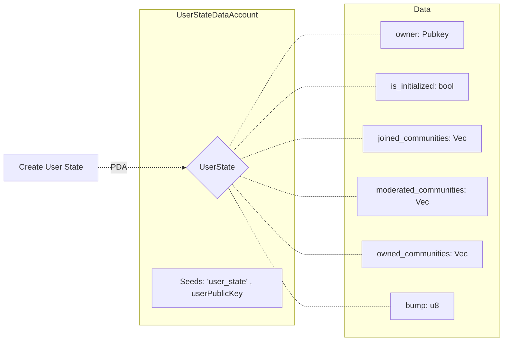

# community_token_solana_contract

Solana Play Ground usage videos for this repo : 
https://loom.com/share/folder/1f864f7bad234f429878ed02589d78c1

```

Community 
|
|--> Create [PDA:"community"+name+id+community_owner.pubkey]
|--> Delete 
|--> Add mod [ init -> Community Account to User]
|--> Add user [ init -> Community Account to User]
|--> Remove mod
|--> Remove user
|
|--> | Product
     | 
     |-> Create and Add product [PDA:"product"+community_account.pubkey+id]
     |-> Remove Product
     |-> Edit Product
     
User
|
|--> Create State Account [PDA:"user_state"+user.pubkey]
|--/ Create Community Account [PDA:"community_member"+community_account.pubkey+user.pubkey]
|--> Edit Community Account 
```
# Community Tokens


> TR
> Bu projede kendi içinde ticaret yapan komünitelerin , ticaretlerinde kendi tokenlarını kullanarak güvenli para transferi yapmasını sağlayan bir sistem yapılmıştır.
> Bir komüniti oluşturup , kendinize ait token üretebilirsiniz ve bu tokenı üyelerinize satabilmeniz için ürün oluşturabilirsiniz.

> EN
> In this project, a system was created that enables the communities that trade within themselves to transfer money securely by using their own tokens in their trade.
> You can create a community, generate your own token, and create a product so that you can sell this token to your members.


# Future
> TR
Ürettiğiniz tokenlar diğer uygulamalar tarafından API desteği ile kullanılarak ,güvenli ticaret ortamı kurmuş olacaksınız.

> En
By using the tokens you produce with API support by other applications, you will establish a secure trading environment.


# Kullanım kılavuzu - Guide

##  User State Account
> TR
- Her şeyden önce programın sizin state'inizi tutabilmesi için `createUserState()` metodu ile kendinize yada kullanıcıya account oluşturmalısınız.
- Bu metod bir PDA ile state account'u üretir.
> EN
- First of all, you should create an account for yourself or the user with the `createUserState()` method so that the program can keep your state.
-  This method generates the state account with a PDA.

```ts
const  custom_member = anchor.web3.Keypair.generate();
const  custom_member_state = anchor.web3.PublicKey.findProgramAddressSync(
	[
		anchor.utils.bytes.utf8.encode('user_state'),
		custom_member.publicKey.toBuffer(),
	],
	program.programId
)[0];
let tx = await  program.methods.createUserState().accounts(
{
	owner:  custom_member.publicKey,
	userState:  custom_member_state,
	systemProgram:  anchor.web3.SystemProgram.programId,
}
).signers([custom_member])
.rpc();

console.log(tx);
```


## Create Community

> TR
>  - 	State accountunuzu oluşturduktan sonra , komünite oluşturabilirsiniz.
>  - Bunun için komünitenizin PDA ile public keyini belirtilen seedlere göre üretmelisiniz ve komüniteniz için bir cüzdan oluşturmalısınız. Frontend tarafında bu otomatik yapılacak.
>  -  `createCommunity()` metodu ile argümentleri ve accountları verdikten sonra bir komünite accountu oluşturabilirsiniz.
>
> **PDA üretirken verdiğiniz id ve isim , oluşturukende aynı olmalıdır.**

>EN
> - After creating your state account, you can create a community.
> - For this, you must generate the public key of your community with the PDA according to the specified seeds.
> - You can create a community account after giving the arguments and accounts with the `createCommunity()` method.
> 
> **The id and name you gave while generating the PDA must be the same as when creating it.**
```ts

const  community_wallet_keypair = anchor.web3.Keypair.generate();
let  community_wallet = new  anchor.Wallet(community_wallet_keypair);

const  community = anchor.web3.PublicKey.findProgramAddressSync(
	[
		anchor.utils.bytes.utf8.encode('community'),
		anchor.utils.bytes.utf8.encode('new_community'),
		new  anchor.BN(2).toArrayLike(Buffer, "le", 8),
		provider.wallet.publicKey.toBuffer(),
	],
		program.programId
)[0];

const  tx = await  program.methods.

createCommunity(
	"new_community",
	new  anchor.BN(2),
	community_wallet.publicKey,
	"https://arweave.net/e_s6UUVQXtfyy91R0joZxhc7Di7xzxOHGSPLGpgwu_Q",
	"Description",
).accounts(
	{
		communityAccount:  community,
		userState:  owner_state,
		communityOwner:  provider.wallet.publicKey,
		communityMember:  community_member_account_owner,
		systemProgram:  anchor.web3.SystemProgram.programId,
	}
).rpc();
console.log("Your transaction signature", tx);

```


